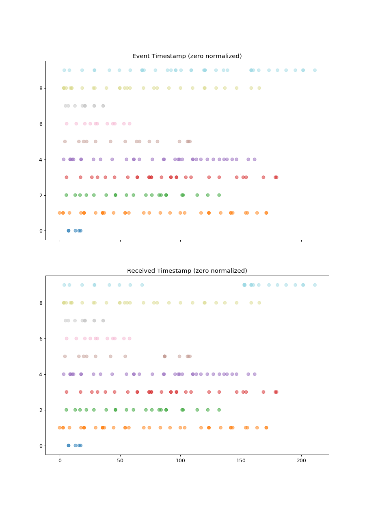

# Event Simulator with random late data

## Overview

The simulator emits events in realtime controlled by a simple model:

- There are `n` workers that create `m` sessions
- Each session is controlled by four parameters
    - *Maximum number of events*: Upper limit of session lenght
    - *Minimum number of events*: avoid empty sessions
    - *Average event interval in millisec*: the average time between two events in one session
    - *Standard deviation of event intervals*: controls the variance of interval lenghts
- Late data will be created for "some" of the "mobile" clients
    - *Mobile ratio*: controls the ratio of "mobile sessions" for the simulation
    - *Bufferd ratio*: the ratio of "mobile sessions" that "get interrupted" somewhere, which events will be buffered and emitted after "network coverage is back".
- Additionnally a network latency can be provided
    - *Average network delay* in millisec

The simulator

- is meant to run ongoingly and emits events in real time.
- is written in Go with `n` goroutines (workers) emitting `m` sessions according to the model above.
- pushes all events to a Kafka topic

The result record looks like:

    {
        "Kind": "m",
        "ClientID": 2,
        "Timestamp": 1540636807739,
        "SessionID": "4517c08a-3b92-426f-9d9d-704a2ba22449",
        "EventID": 1,
        "Data": {
            "Values": 17,
            "Errors": 0
        }
    }

The payload is simply `{"Values":<int>, "Errors": <int>}`, e.g. like a monitoring event that counts measurements and returns this count in `Values` and how many errors were detected in `Errors`. From a streaming persepctive aggregations like "average errors per session", "sum of values per session", ... can be calculated. Combined with windowing and watermarks, the effect of late data can be analysed and mitigated.

A simple example for 10 workers creating 10 sessions, i.e. one session per worker looks like (x-axis shows event/received timestamp in seconds, y-axis: shows session number, dots in one session/row are the events per session):

The 10 sessions are color coded and ran in parallel. For session 9 (blue) the event stream stalled at about 70 sec and recovered at about 150 sec by batch sending the buffered events. Afterwards it continues normally (see bottom graph and compare with top graph).
Similar situation for session 5 (brown).

A more thorough analysis via [pandas](https://pandas.pydata.org/) and a 100 session sample can be found in [EvalSimulatedEvents.ipynb](./docs/EvalSimulatedEvents.ipynb).

## Installation

Assuming `go` is installed and `$GOPATH` and `$GOBIN` are configured:

Install libraries

    go get -u github.com/satori/go.uuid
    go get -u github.com/sirupsen/logrus
    go get -u github.com/segmentio/kafka-go

Install `eventsim`

    go install eventsim.go config.go

    ls -l $GOBIN/eventsim
    # -rwxr-xr-x  1 bernhard  staff  5349444 27 Okt 14:45 eventsim

    $GOBIN/eventsim -h
    # Usage of /Users/bernhard/Development/go/bin/eventsim:
    # -config string
    #        config json file (default "./config.json")

## Configuration

A yaml config file can be provided:

    workers: 10
    sessions: 10
    sessionDelayMs: 10000
    seed: 50
    kafka:
      broker: master1:6667
      topic: sessions
    logging:
      logFile: ./log.txt
      logLevel: debug
    model:
      avgEventIntervalMs: 5000
      avgNwDelayMs: 10
      bufferdRatio: 0.2
      eventIntervalStddev: 5000
      maxNumEvents: 40
      minNumEvents: 5
      mobileRatio: 0.75

The model parameters are explained above, the other parameteres should be clear.
